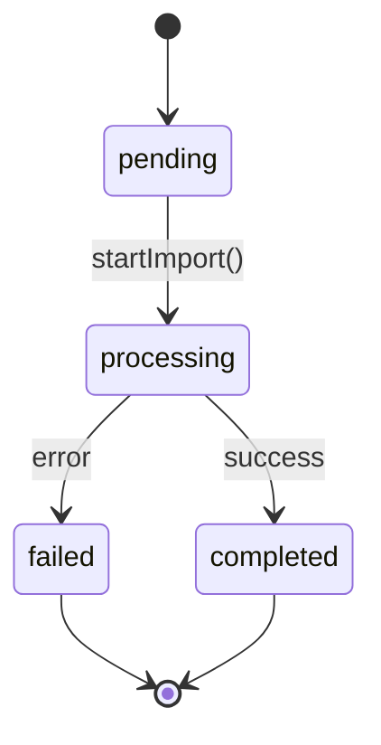
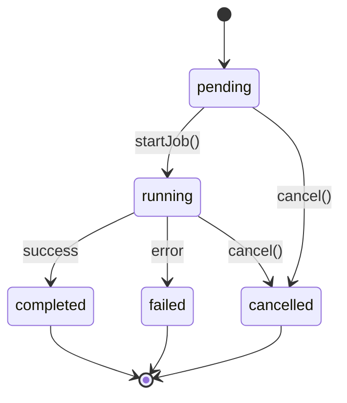
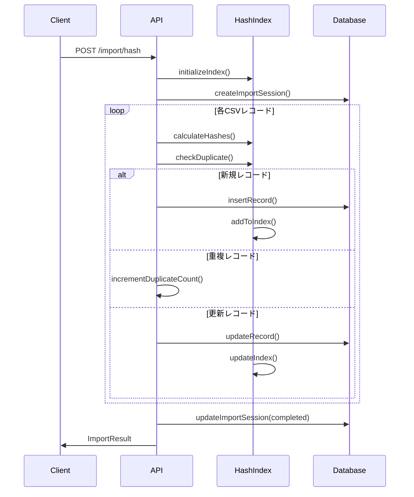

# ETC明細APIシステム データモデル仕様書

## 概要

ETC明細APIシステムは、ETCカード利用明細データと車両運行データ（デジタル運行記録計データ）を管理し、両者を自動的または手動で関連付けするシステムです。本ドキュメントでは、システムで使用される全てのデータモデル、データベーススキーマ、バリデーションルール、およびデータフローについて説明します。

## 1. コアエンティティ

### 1.1 ETCMeisai（ETC明細）

**説明**: ETC利用明細の基本データを表現するメインエンティティ

```go
type ETCMeisai struct {
    ID               int64      `json:"id"`                     // 一意識別子
    DateTo           time.Time  `json:"date_to"`                // 利用日時（至）
    ETCNum           string     `json:"etc_num"`                // ETCカード番号
    Price            int        `json:"price"`                  // 通行料金
    DtakoRowID       string     `json:"dtako_row_id,omitempty"` // デジタコ運行ID（関連付け用）
    UnkoNo           string     `json:"unko_no"`                // 運行NO
    Date             time.Time  `json:"date"`                   // 日付
    Time             string     `json:"time"`                   // 時刻
    ICEntry          string     `json:"ic_entry"`               // IC入口
    ICExit           string     `json:"ic_exit"`                // IC出口
    VehicleNo        string     `json:"vehicle_no"`             // 車両番号
    CardNo           string     `json:"card_no"`                // ETCカード番号
    Amount           int        `json:"amount"`                 // 利用金額
    DiscountAmount   int        `json:"discount_amount"`        // 割引金額
    TotalAmount      int        `json:"total_amount"`           // 請求金額
    UsageType        string     `json:"usage_type"`             // 利用区分
    PaymentMethod    string     `json:"payment_method"`         // 支払方法
    RouteCode        string     `json:"route_code"`             // 路線コード
    Distance         float64    `json:"distance"`               // 走行距離
    TollGate         string     `json:"toll_gate"`              // 料金所名
    VehicleType      string     `json:"vehicle_type"`           // 車種
    Remarks          string     `json:"remarks"`                // 備考
    CreatedAt        *time.Time `json:"created_at,omitempty"`   // 作成日時
    UpdatedAt        *time.Time `json:"updated_at,omitempty"`   // 更新日時
}
```

**フィールド詳細**:
- `Date`、`Time`、`ICEntry`、`ICExit`、`VehicleNo`、`CardNo`、`TotalAmount` は重複検出用ハッシュの対象フィールド
- 金額系フィールド（`Amount`、`DiscountAmount`、`TotalAmount`）は整数型（円単位）
- `Distance`は小数点2桁までの精度を持つ走行距離（km）

### 1.2 ETCMeisaiWithHash（ハッシュ付きETC明細）

**説明**: 重複検出とデータ整合性管理のためのハッシュ値を含むETC明細

```go
type ETCMeisaiWithHash struct {
    ETCMeisai
    RecordHash      string `json:"record_hash"`              // 重複検出用ハッシュ（xxHash128）
    ContentHash     string `json:"content_hash"`             // 変更検出用ハッシュ（SHA256）
    ImportSessionID string `json:"import_session_id,omitempty"` // インポートセッションID
}
```

**ハッシュアルゴリズム**:
- **RecordHash**: xxHash128アルゴリズムを使用した高速重複検出用ハッシュ
- **ContentHash**: SHA256アルゴリズムを使用したデータ変更検出用ハッシュ

### 1.3 DtakoRow（デジタコ運行データ）

**説明**: 車両の運行記録データを表現するエンティティ

```go
type DtakoRow struct {
    RowID      string         `json:"row_id" db:"row_id"`     // 運行レコードID
    VehicleID  string         `json:"vehicle_id" db:"vehicle_id"` // 車両ID
    Date       time.Time      `json:"date" db:"date"`         // 運行日
    StartTime  string         `json:"start_time" db:"start_time"` // 開始時刻
    EndTime    string         `json:"end_time" db:"end_time"` // 終了時刻
    Distance   float64        `json:"distance" db:"distance"` // 走行距離
    DriverID   sql.NullString `json:"driver_id,omitempty" db:"driver_id"` // ドライバーID（任意）
    RouteName  sql.NullString `json:"route_name,omitempty" db:"route_name"` // 路線名（任意）
    CreatedAt  time.Time      `json:"created_at" db:"created_at"` // 作成日時
}
```

**バリデーション**:
- `RowID`、`VehicleID`は必須
- `Distance`は非負の値
- `Date`は未来日不可

### 1.4 ETCDtakoMapping（ETC-デジタコマッピング）

**説明**: ETC明細とデジタコ運行データの関連付けを管理するエンティティ

```go
type ETCDtakoMapping struct {
    ID           int64     `json:"id" db:"id"`                 // 一意識別子
    ETCMeisaiID  int64     `json:"etc_meisai_id" db:"etc_meisai_id"` // ETC明細ID
    DtakoRowID   string    `json:"dtako_row_id" db:"dtako_row_id"`   // デジタコ運行ID
    VehicleID    string    `json:"vehicle_id,omitempty" db:"vehicle_id"` // 車両ID
    MappingType  string    `json:"mapping_type" db:"mapping_type"`   // マッピングタイプ
    Notes        string    `json:"notes,omitempty" db:"notes"`       // 備考
    CreatedAt    time.Time `json:"created_at" db:"created_at"`       // 作成日時
    UpdatedAt    time.Time `json:"updated_at" db:"updated_at"`       // 更新日時
    CreatedBy    string    `json:"created_by,omitempty" db:"created_by"` // 作成者
}
```

**MappingTypeの種類**:
- `manual`: 手動マッピング
- `auto_exact`: 完全自動マッチ（高精度）
- `auto_partial`: 部分自動マッチ（中精度）
- `auto_candidate`: 候補自動マッチ（要確認）

## 2. セッション管理エンティティ

### 2.1 ImportSession（インポートセッション）

**説明**: データインポートプロセスの状態管理

```go
type ImportSession struct {
    ID             string     `json:"id"`               // セッションID（UUID）
    StartedAt      time.Time  `json:"started_at"`       // 開始時刻
    CompletedAt    *time.Time `json:"completed_at"`     // 完了時刻
    Status         string     `json:"status"`           // ステータス
    TotalRecords   int        `json:"total_records"`    // 総レコード数
    ProcessedCount int        `json:"processed_count"`  // 処理済みレコード数
    AddedCount     int        `json:"added_count"`      // 追加レコード数
    UpdatedCount   int        `json:"updated_count"`    // 更新レコード数
    DuplicateCount int        `json:"duplicate_count"`  // 重複レコード数
    ErrorCount     int        `json:"error_count"`      // エラーレコード数
    Errors         []string   `json:"errors,omitempty"` // エラーメッセージ
}
```

**ステータス遷移**:
```
pending → processing → completed
pending → processing → failed
```

### 2.2 MappingBatchJob（マッピングバッチジョブ）

**説明**: 大量データのマッピング処理ジョブ管理

```go
type MappingBatchJob struct {
    ID               int64          `json:"id" db:"id"`
    Status           string         `json:"status" db:"status"`
    StartDate        time.Time      `json:"start_date" db:"start_date"`
    EndDate          time.Time      `json:"end_date" db:"end_date"`
    TotalRecords     int            `json:"total_records" db:"total_records"`
    ProcessedRecords int            `json:"processed_records" db:"processed_records"`
    MatchedRecords   int            `json:"matched_records" db:"matched_records"`
    ErrorCount       int            `json:"error_count" db:"error_count"`
    ErrorDetails     sql.NullString `json:"error_details,omitempty" db:"error_details"`
    StartedAt        sql.NullTime   `json:"started_at,omitempty" db:"started_at"`
    CompletedAt      sql.NullTime   `json:"completed_at,omitempty" db:"completed_at"`
    CreatedAt        time.Time      `json:"created_at" db:"created_at"`
    CreatedBy        sql.NullString `json:"created_by,omitempty" db:"created_by"`
}
```

**ジョブステータス遷移**:
```
pending → running → completed
pending → running → failed
pending → cancelled
running → cancelled
```

## 3. データベーススキーマ

### 3.1 etc_meisai テーブル

```sql
CREATE TABLE IF NOT EXISTS etc_meisai (
    id INT AUTO_INCREMENT PRIMARY KEY,
    unko_no VARCHAR(50) NOT NULL COMMENT '運行NO',
    date DATE NOT NULL COMMENT '日付',
    time VARCHAR(10) NOT NULL COMMENT '時刻',
    ic_entry VARCHAR(100) COMMENT 'IC入口',
    ic_exit VARCHAR(100) COMMENT 'IC出口',
    vehicle_no VARCHAR(50) NOT NULL COMMENT '車両番号',
    card_no VARCHAR(50) NOT NULL COMMENT 'ETCカード番号',
    amount INT NOT NULL DEFAULT 0 COMMENT '利用金額',
    discount_amount INT NOT NULL DEFAULT 0 COMMENT '割引金額',
    total_amount INT NOT NULL DEFAULT 0 COMMENT '請求金額',
    usage_type VARCHAR(50) COMMENT '利用区分',
    payment_method VARCHAR(50) COMMENT '支払方法',
    route_code VARCHAR(50) COMMENT '路線コード',
    distance DECIMAL(10,2) DEFAULT 0 COMMENT '走行距離',
    created_at TIMESTAMP DEFAULT CURRENT_TIMESTAMP,
    updated_at TIMESTAMP DEFAULT CURRENT_TIMESTAMP ON UPDATE CURRENT_TIMESTAMP,

    INDEX idx_unko_no (unko_no),
    INDEX idx_date (date),
    INDEX idx_vehicle_no (vehicle_no),
    INDEX idx_card_no (card_no)
) ENGINE=InnoDB DEFAULT CHARSET=utf8mb4 COLLATE=utf8mb4_unicode_ci;
```

### 3.2 etc_dtako_mapping テーブル

```sql
CREATE TABLE IF NOT EXISTS etc_dtako_mapping (
    id INT AUTO_INCREMENT PRIMARY KEY,
    etc_meisai_id INT NOT NULL,
    dtako_row_id VARCHAR(100) NOT NULL,
    vehicle_id VARCHAR(50),
    mapping_type VARCHAR(20) NOT NULL DEFAULT 'manual',
    notes TEXT,
    created_at TIMESTAMP DEFAULT CURRENT_TIMESTAMP,
    updated_at TIMESTAMP DEFAULT CURRENT_TIMESTAMP ON UPDATE CURRENT_TIMESTAMP,
    created_by VARCHAR(100),

    CONSTRAINT fk_etc_meisai
        FOREIGN KEY (etc_meisai_id)
        REFERENCES etc_meisai(id)
        ON DELETE CASCADE,

    INDEX idx_etc_meisai_id (etc_meisai_id),
    INDEX idx_dtako_row_id (dtako_row_id),
    INDEX idx_vehicle_id (vehicle_id),
    INDEX idx_mapping_type (mapping_type),
    UNIQUE KEY unique_meisai_dtako (etc_meisai_id, dtako_row_id)
) ENGINE=InnoDB DEFAULT CHARSET=utf8mb4 COLLATE=utf8mb4_unicode_ci;
```

### 3.3 mapping_batch_jobs テーブル

```sql
CREATE TABLE IF NOT EXISTS mapping_batch_jobs (
    id INT AUTO_INCREMENT PRIMARY KEY,
    status VARCHAR(20) NOT NULL DEFAULT 'pending' COMMENT 'pending, running, completed, failed, cancelled',
    start_date DATE NOT NULL COMMENT '処理開始日',
    end_date DATE NOT NULL COMMENT '処理終了日',
    total_records INT DEFAULT 0 COMMENT '総レコード数',
    processed_records INT DEFAULT 0 COMMENT '処理済みレコード数',
    matched_records INT DEFAULT 0 COMMENT 'マッチ成功数',
    error_count INT DEFAULT 0 COMMENT 'エラー数',
    error_details TEXT COMMENT 'エラー詳細',
    started_at TIMESTAMP NULL COMMENT '開始時刻',
    completed_at TIMESTAMP NULL COMMENT '完了時刻',
    created_at TIMESTAMP DEFAULT CURRENT_TIMESTAMP COMMENT '作成日時',
    created_by VARCHAR(100) COMMENT '作成者',

    INDEX idx_status (status),
    INDEX idx_created_at (created_at)
) ENGINE=InnoDB DEFAULT CHARSET=utf8mb4 COLLATE=utf8mb4_unicode_ci
COMMENT='バッチ処理ジョブ管理テーブル';
```

## 4. エンティティ間関係

### 4.1 リレーション図

```
ETCMeisai (1) ←--→ (0..n) ETCDtakoMapping ←--→ (1) DtakoRow
    ↑                        ↑
    |                        |
    └── ImportSession -------┘

MappingBatchJob → (処理対象) ETCDtakoMapping
HashIndex → (キャッシュ) ETCMeisaiWithHash
```

### 4.2 主要な関係

1. **ETCMeisai ← ETCDtakoMapping**
   - 一対多の関係（一つのETC明細は複数のマッピングを持つ可能性）
   - 外部キー制約により参照整合性を保証
   - CASCADE DELETE により、ETC明細削除時にマッピングも削除

2. **DtakoRow ← ETCDtakoMapping**
   - 一対多の関係（一つの運行データは複数のETC利用と関連付け可能）
   - `dtako_row_id`による論理的結合

3. **ImportSession → ETCMeisaiWithHash**
   - セッション管理による一括インポート操作の追跡
   - インポート処理の状態管理とロールバック機能

## 5. バリデーションルール

### 5.1 ETCMeisai バリデーション

```go
func (e *ETCMeisai) Validate() error {
    errors := make([]string, 0)

    // 必須フィールドチェック
    if e.UnkoNo == "" {
        errors = append(errors, "運行NOは必須です")
    }
    if e.VehicleNo == "" {
        errors = append(errors, "車両番号は必須です")
    }
    if e.CardNo == "" {
        errors = append(errors, "ETCカード番号は必須です")
    }

    // 金額チェック
    if e.Amount < 0 {
        errors = append(errors, "利用金額は非負の値である必要があります")
    }
    if e.DiscountAmount < 0 {
        errors = append(errors, "割引金額は非負の値である必要があります")
    }
    if e.TotalAmount < 0 {
        errors = append(errors, "請求金額は非負の値である必要があります")
    }

    // 距離チェック
    if e.Distance < 0 {
        errors = append(errors, "走行距離は非負の値である必要があります")
    }

    // 日付チェック
    if e.Date.After(time.Now().AddDate(0, 0, 1)) {
        errors = append(errors, "日付は未来日を指定できません")
    }

    if len(errors) > 0 {
        return fmt.Errorf("バリデーションエラー: %s", strings.Join(errors, ", "))
    }
    return nil
}
```

### 5.2 ETCDtakoMapping バリデーション

```go
func (m *ETCDtakoMapping) Validate() error {
    // MappingType チェック
    validTypes := []string{"manual", "auto_exact", "auto_partial", "auto_candidate"}
    if !contains(validTypes, m.MappingType) {
        return fmt.Errorf("無効なマッピングタイプ: %s", m.MappingType)
    }

    // 必須フィールドチェック
    if m.ETCMeisaiID <= 0 {
        return fmt.Errorf("ETC明細IDは正の値である必要があります")
    }
    if m.DtakoRowID == "" {
        return fmt.Errorf("デジタコ運行IDは必須です")
    }

    return nil
}
```

### 5.3 DtakoRow バリデーション

```go
func (d *DtakoRow) IsValid() bool {
    // 基本バリデーション
    if d.RowID == "" || d.VehicleID == "" {
        return false
    }

    // 距離チェック
    if d.Distance < 0 {
        return false
    }

    // 日付チェック
    if d.Date.After(time.Now()) {
        return false
    }

    return true
}
```

## 6. ステートマシンとライフサイクル

### 6.1 ImportSession ステートマシン



**状態説明**:
- `pending`: インポートセッション作成済み、処理待ち
- `processing`: インポート処理中
- `completed`: インポート完了（成功）
- `failed`: インポート失敗

**状態遷移条件**:
- `pending` → `processing`: `StartImport()`メソッド呼び出し
- `processing` → `completed`: 全レコード処理完了、エラー数 = 0
- `processing` → `failed`: 致命的エラー発生またはタイムアウト

### 6.2 MappingBatchJob ステートマシン



**状態説明**:
- `pending`: ジョブ作成済み、実行待ち
- `running`: バッチ処理実行中
- `completed`: バッチ処理完了
- `failed`: バッチ処理失敗
- `cancelled`: バッチ処理キャンセル

### 6.3 データインポートライフサイクル



## 7. ハッシュシステムとデータ整合性

### 7.1 ハッシュアルゴリズム設定

```go
var DefaultHashConfigs = map[string]HashConfig{
    "record": {
        Algorithm:     "xxhash128",
        Fields:        []string{"Date", "Time", "ICEntry", "ICExit", "VehicleNo", "CardNo", "TotalAmount"},
        CaseSensitive: false,
        Normalization: true,
    },
    "content": {
        Algorithm:     "sha256",
        Fields:        []string{"all"},
        IgnoreFields:  []string{"ID", "CreatedAt", "UpdatedAt", "RecordHash", "ContentHash", "ImportSessionID"},
        CaseSensitive: true,
        Normalization: true,
    },
}
```

### 7.2 HashIndex 管理

```go
type HashIndex struct {
    recordHashes  map[string]*ETCMeisaiWithHash // レコードハッシュ→レコード
    contentHashes map[string]string              // コンテンツハッシュ→レコードハッシュ
    lastUpdated   time.Time                      // 最終更新時刻
    recordCount   int                            // レコード数
    mutex         sync.RWMutex                   // 並行アクセス制御
}
```

**機能**:
- 重複検出の高速化（O(1)検索）
- データ変更の検出
- 並行アクセス安全性
- メモリ効率的なインデックス管理

## 8. データフローとビジネスロジック

### 8.1 ETCデータインポートフロー

1. **前処理**
   - CSVファイル検証
   - ヘッダー形式チェック
   - ImportSession作成

2. **レコード処理**
   - 各行のパース
   - データバリデーション
   - ハッシュ値計算（RecordHash, ContentHash）
   - 重複チェック

3. **データベース操作**
   - 新規レコード：INSERT
   - 重複レコード：スキップまたは更新
   - エラーレコード：ログ記録

4. **後処理**
   - ImportSession更新
   - ハッシュインデックス更新
   - 結果レポート生成

### 8.2 自動マッピングフロー

1. **マッチング候補検索**
   - 日付範囲での絞り込み
   - 車両番号マッチング
   - 時間範囲重複チェック

2. **マッチング精度評価**
   - 完全マッチ：`auto_exact`
   - 部分マッチ：`auto_partial`
   - 候補マッチ：`auto_candidate`

3. **マッピング作成**
   - 高精度マッチの自動承認
   - 低精度マッチの候補登録
   - 人間による確認待ち状態

### 8.3 バッチ処理フロー

1. **ジョブ初期化**
   - MappingBatchJob作成
   - 処理対象データ抽出
   - ワーカープロセス起動

2. **並列処理**
   - 複数ワーカーでの並列マッピング
   - プログレス追跡
   - エラーハンドリング

3. **完了処理**
   - 結果集計
   - ジョブステータス更新
   - 通知送信（オプション）

## 9. パフォーマンス考慮事項

### 9.1 データベースインデックス戦略

- **etc_meisai**: `unko_no`, `date`, `vehicle_no`, `card_no`にインデックス
- **etc_dtako_mapping**: `etc_meisai_id`, `dtako_row_id`, `vehicle_id`, `mapping_type`にインデックス
- **複合インデックス**: `unique_meisai_dtako (etc_meisai_id, dtako_row_id)`で重複防止

### 9.2 メモリ管理

- **HashIndex**: 大量データ時のメモリ使用量制御
- **バッチサイズ**: デフォルト1000件単位での処理
- **キャッシュ**: 頻繁にアクセスされるデータのメモリキャッシュ

### 9.3 並行処理

- **読み取り専用操作**: `sync.RWMutex`による並行読み取り許可
- **書き込み操作**: 排他制御によるデータ整合性保証
- **バッチジョブ**: 設定可能なワーカー数による並列処理

## 10. エラーハンドリングとロギング

### 10.1 エラー分類

1. **バリデーションエラー**: データ形式不正、必須項目不足
2. **ビジネスロジックエラー**: 重複制約違反、外部キー制約違反
3. **システムエラー**: データベース接続エラー、ファイルアクセスエラー
4. **外部システムエラー**: デジタコシステム連携エラー

### 10.2 ログレベル

- **ERROR**: システムエラー、予期しない例外
- **WARN**: ビジネスロジックエラー、データ品質警告
- **INFO**: 正常処理フロー、重要なステート変更
- **DEBUG**: 詳細な処理トレース、パフォーマンス情報

## 11. セキュリティとアクセス制御

### 11.1 データアクセス制御

- **認証**: APIキーまたはJWTトークンベース認証
- **認可**: ロールベースアクセス制御（管理者、オペレーター、閲覧者）
- **監査**: 全てのCUD操作のログ記録

### 11.2 データプライバシー

- **個人情報**: 車両番号、ドライバーIDの暗号化
- **PII削除**: 定期的な古いデータの匿名化
- **アクセスログ**: 個人情報アクセスの詳細記録

## 12. 今後の拡張可能性

### 12.1 計画中の機能

1. **リアルタイム同期**: WebSocketによるリアルタイムマッピング状況通知
2. **ML自動マッピング**: 機械学習による高精度自動マッピング
3. **データ分析**: ETCデータの統計分析とレポート機能
4. **API拡張**: GraphQL APIサポート

### 12.2 スケーラビリティ

- **水平スケーリング**: マイクロサービス化
- **分散処理**: Apache Kafkaによる非同期メッセージング
- **クラウド対応**: Kubernetes対応のコンテナ化

---

**更新履歴**
- 2025-09-18: 初版作成
- 2025-09-18: ハッシュシステム、バッチ処理機能追加

**関連ドキュメント**
- API仕様書: `/docs/api-spec.md`
- デプロイメントガイド: `/docs/deployment.md`
- テスト仕様書: `/docs/test-spec.md`