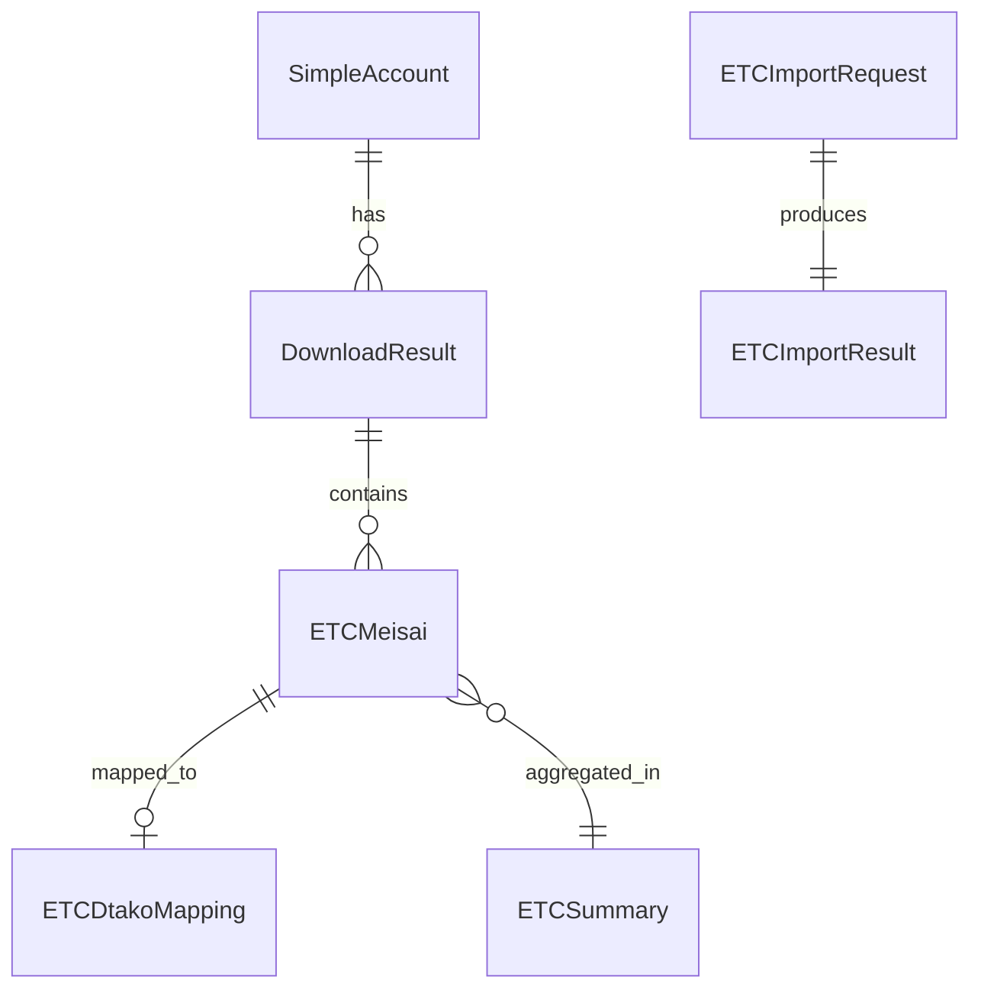

# データモデル定義: ETC明細Goモジュール

**日付**: 2025-09-18
**フェーズ**: 1 (設計)

## エンティティ一覧

### 1. ETCアカウント（SimpleAccount）

**用途**: ETCポータルサイトへのログイン情報管理

| フィールド | 型 | 必須 | 説明 | 検証ルール |
|-----------|-----|------|------|-----------|
| UserID | string | ✓ | ユーザーID | 空文字不可 |
| Password | string | ✓ | パスワード | 空文字不可 |
| Type | string | ✓ | アカウントタイプ | "corporate" または "personal" |

**状態遷移**: なし（静的データ）

### 2. ETC明細（ETCMeisai）

**用途**: ETCゲート通過記録の詳細情報

| フィールド | 型 | 必須 | 説明 | 検証ルール |
|-----------|-----|------|------|-----------|
| ID | int64 | ✓ | 一意識別子（自動採番） | PRIMARY KEY |
| UsageDate | time.Time | ✓ | 利用日 | 過去日付のみ |
| EntryIC | string | ✓ | 入口IC名 | 空文字不可 |
| ExitIC | string | ✓ | 出口IC名 | 空文字不可 |
| RouteInfo | string | ✓ | 経路情報 | - |
| VehicleNum | string | ✓ | 車両番号 | 日本の車両番号形式 |
| ETCCardNo | string | ✓ | ETCカード番号 | 16桁の数字 |
| EntryTime | string | ○ | 入口通過時刻 | HH:MM形式 |
| ExitTime | string | ○ | 出口通過時刻 | HH:MM形式 |
| TotalCharge | int | ✓ | 料金（円） | 0以上 |
| UnkoNo | string | ○ | 運行番号 | - |
| Direction | string | ○ | 方向（上り/下り） | "上り", "下り", "不明" |
| ImportedAt | time.Time | ✓ | インポート日時 | 自動設定 |
| AccountType | string | ✓ | アカウント種別 | "corporate" または "personal" |
| AccountUserID | string | ✓ | アカウントID | 空文字不可 |

**状態遷移**:
```
[新規] → [保存済み] → [マッピング済み]
```

### 3. ダウンロードジョブ（DownloadResult）

**用途**: 非同期ダウンロード処理の結果管理

| フィールド | 型 | 必須 | 説明 | 検証ルール |
|-----------|-----|------|------|-----------|
| JobID | string | ✓ | ジョブID（UUID） | UUID形式 |
| AccountID | string | ✓ | アカウントID | 空文字不可 |
| Status | string | ✓ | ステータス | 下記参照 |
| Progress | int | ✓ | 進捗率 | 0-100 |
| CSVPath | string | ○ | CSVファイルパス | ファイル存在確認 |
| RecordCount | int | ○ | レコード数 | 0以上 |
| Error | string | ○ | エラーメッセージ | - |
| StartedAt | time.Time | ✓ | 開始日時 | 自動設定 |
| CompletedAt | time.Time | ○ | 完了日時 | StartedAt以降 |
| Records | []ETCMeisai | ○ | パース済みレコード | - |

**状態遷移**:
```
[pending] → [running] → [completed]
                    ↓
                [failed]
```

**ステータス値**:
- `pending`: 待機中
- `running`: 実行中
- `completed`: 完了
- `failed`: 失敗

### 4. ETCデジタコマッピング（ETCDtakoMapping）

**用途**: ETC明細とデジタコデータの関連付け

| フィールド | 型 | 必須 | 説明 | 検証ルール |
|-----------|-----|------|------|-----------|
| ID | int64 | ✓ | 一意識別子 | PRIMARY KEY |
| ETCMeisaiID | int64 | ✓ | ETC明細ID | FOREIGN KEY → ETCMeisai.ID |
| DtakoRowID | string | ✓ | デジタコ行ID | 空文字不可 |
| MappingType | string | ✓ | マッピング種別 | "auto" または "manual" |
| MatchScore | float64 | ○ | マッチングスコア | 0.0-1.0 |
| CreatedBy | string | ✓ | 作成者 | システムまたはユーザーID |
| CreatedAt | time.Time | ✓ | 作成日時 | 自動設定 |
| UpdatedAt | time.Time | ✓ | 更新日時 | 自動設定 |
| IsActive | bool | ✓ | アクティブフラグ | デフォルト: true |

**状態遷移**:
```
[新規] → [アクティブ] → [非アクティブ]
           ↓      ↑
        [更新済み]
```

### 5. インポートリクエスト（ETCImportRequest）

**用途**: データインポート処理のリクエスト管理

| フィールド | 型 | 必須 | 説明 | 検証ルール |
|-----------|-----|------|------|-----------|
| FromDate | time.Time | ✓ | 開始日 | ToDate以前 |
| ToDate | time.Time | ✓ | 終了日 | FromDate以降 |
| Accounts | []SimpleAccount | ✓ | 対象アカウント | 1件以上 |
| Mode | string | ✓ | インポートモード | "sync" または "async" |
| OverwriteExisting | bool | ○ | 既存データ上書き | デフォルト: false |

### 6. インポート結果（ETCImportResult）

**用途**: データインポート処理の結果管理

| フィールド | 型 | 必須 | 説明 | 検証ルール |
|-----------|-----|------|------|-----------|
| TotalRecords | int | ✓ | 総レコード数 | 0以上 |
| ImportedRecords | int | ✓ | インポート成功数 | 0以上 |
| SkippedRecords | int | ✓ | スキップ数 | 0以上 |
| FailedRecords | int | ✓ | 失敗数 | 0以上 |
| Errors | []ImportError | ○ | エラー詳細 | - |
| Duration | time.Duration | ✓ | 処理時間 | 0以上 |

### 7. サマリー情報（ETCSummary）

**用途**: 統計情報の集計結果

| フィールド | 型 | 必須 | 説明 | 検証ルール |
|-----------|-----|------|------|-----------|
| Period | string | ✓ | 集計期間 | "daily", "weekly", "monthly" |
| StartDate | time.Time | ✓ | 開始日 | EndDate以前 |
| EndDate | time.Time | ✓ | 終了日 | StartDate以降 |
| TotalRecords | int | ✓ | 総レコード数 | 0以上 |
| TotalAmount | int64 | ✓ | 合計金額（円） | 0以上 |
| VehicleCount | int | ✓ | 車両数 | 0以上 |
| RouteCount | int | ✓ | 経路数 | 0以上 |
| ByVehicle | map[string]int64 | ○ | 車両別金額 | - |
| ByRoute | map[string]int64 | ○ | 経路別金額 | - |

## リレーションシップ



## インデックス設計

### ETCMeisai
- PRIMARY KEY: `id`
- INDEX: `usage_date, vehicle_num` (検索最適化)
- INDEX: `unko_no` (運行番号検索)
- INDEX: `imported_at` (インポート日時検索)
- UNIQUE: `usage_date, entry_time, exit_time, vehicle_num, etc_card_no` (重複防止)

### ETCDtakoMapping
- PRIMARY KEY: `id`
- UNIQUE: `etc_meisai_id, dtako_row_id` (重複防止)
- INDEX: `dtako_row_id` (逆引き検索)
- INDEX: `created_at` (時系列検索)

### DownloadResult
- PRIMARY KEY: `job_id`
- INDEX: `account_id, started_at` (アカウント別履歴)
- INDEX: `status` (ステータス別検索)

## データ検証ルール

### 1. 一意性制約
- ETC明細: 同一日時・車両・カードの重複不可
- マッピング: 同一ETC明細とデジタコ行の組み合わせは一意

### 2. 整合性制約
- 日付範囲: FromDate <= ToDate
- 進捗率: 0 <= Progress <= 100
- マッチスコア: 0.0 <= MatchScore <= 1.0

### 3. ビジネスルール
- 過去データのみインポート可能（未来日付拒否）
- 車両番号は日本の形式に準拠
- ETCカード番号は16桁の数字

## パフォーマンス考慮事項

### 1. バッチ処理
- バルクインサート: 100,000件/バッチ
- トランザクション単位: 1,000-10,000件

### 2. キャッシュ戦略
- 頻繁アクセスデータ: アカウント情報、最新サマリー
- TTL: 5分（アカウント）、1時間（サマリー）

### 3. クエリ最適化
- 日付範囲検索: パーティショニング考慮
- 集計処理: マテリアライズドビュー検討

---

## 次のステップ

このデータモデル定義を基に：
1. Goインターフェース定義（contracts/）を生成
2. 契約テストを作成
3. クイックスタートガイドを作成